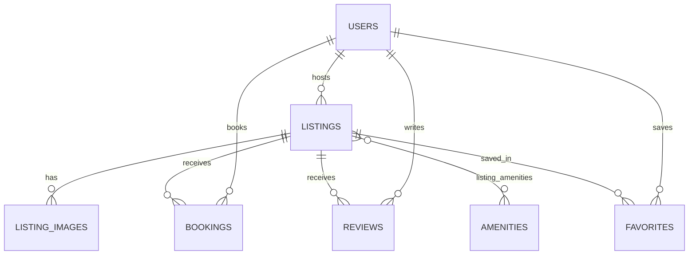

# Airbnb Clone - Fullstack Vacation Rental Marketplace

A fullstack vacation rental marketplace replicating the core user flows and UX of Airbnb. Built from scratch with an original architecture.

---

## Architecture Overview

The system is cleanly separated into two distinct layers:
- **`frontend/`**: Next.js App Router with TypeScript, Tailwind CSS, centralized API client, toast notifications, and UI primitives.
- **`backend/`**: Python FastAPI with SQLAlchemy 2.0 ORM, SQLite database, and Pydantic v2 data schemas.

```
/
├── frontend/
│   ├── app/                    # Next.js App Router (layout, page, styles)
│   ├── components/
│   │   └── ui/                 # Reusable UI primitives (Button, Card, Input, Spinner, Toast)
│   ├── hooks/                  # Custom React hooks (useAsync, useToast)
│   ├── lib/                    # Centralized API client & endpoint definitions
│   ├── types/                  # Shared TypeScript interfaces & types
│   ├── public/                 # Static assets
│   ├── .env.example            # Environment variables template
│   └── package.json
├── backend/
│   ├── app/
│   │   ├── main.py             # FastAPI app setup, CORS, route mounting
│   │   ├── config.py           # Pydantic Settings & environment variables
│   │   ├── database.py         # SQLAlchemy engine, session maker, get_db dependency
│   │   ├── models/             # SQLAlchemy database models
│   │   ├── schemas/            # Pydantic request / response schemas
│   │   ├── routers/            # FastAPI API route handlers
│   │   ├── services/           # Encapsulated business logic layer
│   │   └── seed/               # Database seeding scripts
│   ├── requirements.txt        # Python backend dependencies
│   ├── .env.example            # Backend environment variables template
│   └── airbnb.db               # SQLite database file (generated on startup)
├── README.md
└── .gitignore
```

---

## Tech Stack

### Frontend
- **Framework**: Next.js 16 (App Router)
- **Language**: TypeScript
- **Styling**: Tailwind CSS
- **Icons**: Lucide React
- **Patterns**: Clean UI component isolation, typed API contracts, reactive toast notifications, accessible interactive primitives.

### Backend
- **Framework**: Python FastAPI
- **Server**: Uvicorn (ASGI)
- **Database**: SQLite (SQLAlchemy 2.0 ORM)
- **Validation**: Pydantic v2
- **CORS**: Configured for `http://localhost:3000`

---

## Separation of Concerns

1. **UI Components**: Presentational and interaction only. No direct backend URL or HTTP calls inside components.
2. **Centralized API Client (`frontend/lib/api-client.ts`)**: Standardizes HTTP methods, JSON parsing, query parameter serialization, and structured error throwing (`ApiClientError`).
3. **API Catalog (`frontend/lib/api.ts`)**: Single source of truth for all API calls consumed by frontend pages.
4. **Backend Architecture**:
   - `routers/`: Handle HTTP routing, status codes, and input/output schema binding.
   - `services/`: Encapsulate core business logic independently from transport protocols.
   - `schemas/`: Define contract validation rules using Pydantic.
   - `models/`: Define relational persistence schemas using SQLAlchemy.

---

## Quickstart & Setup

### 1. Backend Setup

```bash
cd backend

# Create virtual environment
python -m venv venv

# Activate virtual environment
# On Windows PowerShell:
.\venv\Scripts\Activate.ps1
# On macOS/Linux:
source venv/bin/activate

# Install dependencies
pip install -r requirements.txt

# Run the development server
uvicorn app.main:app --reload --port 8000
```

The API will be available at:
- **API Base**: `http://localhost:8000`
- **Interactive Swagger Docs**: `http://localhost:8000/docs`
- **Health Check Endpoint**: `http://localhost:8000/api/health`

### 2. Frontend Setup

```bash
cd frontend

# Install dependencies
npm install

# Run the Next.js development server
npm run dev
```

The frontend will be available at `http://localhost:3000`.

---

---

## Database Architecture & Schema

The persistent storage layer uses **SQLite** with **SQLAlchemy 2.0 ORM** and enforces foreign key constraints (`PRAGMA foreign_keys = ON;`).



### Relational Tables & Attributes

1. **`users`**
   - `id` (INTEGER, PK, Autoincrement)
   - `name` (VARCHAR(100), NOT NULL)
   - `email` (VARCHAR(255), UNIQUE, INDEX, NOT NULL)
   - `avatar` (VARCHAR(500), NULLABLE)
   - `role` (VARCHAR(20), NOT NULL, default `'guest'`: `'guest'`, `'host'`)
   - `created_at` (DATETIME, DEFAULT `CURRENT_TIMESTAMP`)

2. **`listings`**
   - `id` (INTEGER, PK, Autoincrement)
   - `host_id` (INTEGER, FK `users.id` ON DELETE CASCADE, INDEX)
   - `title` (VARCHAR(255), NOT NULL)
   - `description` (TEXT, NOT NULL)
   - `property_type` (VARCHAR(50), INDEX, NOT NULL)
   - `location` (VARCHAR(255), NOT NULL)
   - `city` (VARCHAR(100), INDEX, NOT NULL)
   - `country` (VARCHAR(100), INDEX, NOT NULL)
   - `latitude` (FLOAT, NULLABLE)
   - `longitude` (FLOAT, NULLABLE)
   - `price_per_night` (FLOAT, NOT NULL)
   - `cleaning_fee` (FLOAT, DEFAULT `0.0`)
   - `service_fee` (FLOAT, DEFAULT `0.0`)
   - `max_guests` (INTEGER, DEFAULT `1`)
   - `bedrooms` (INTEGER, DEFAULT `1`)
   - `beds` (INTEGER, DEFAULT `1`)
   - `bathrooms` (FLOAT, DEFAULT `1.0`)
   - `created_at` (DATETIME, DEFAULT `CURRENT_TIMESTAMP`)
   - `updated_at` (DATETIME, DEFAULT `CURRENT_TIMESTAMP`, ON UPDATE `CURRENT_TIMESTAMP`)
   - *Indexes*: `(city, country)`, `(price_per_night)`

3. **`listing_images`**
   - `id` (INTEGER, PK, Autoincrement)
   - `listing_id` (INTEGER, FK `listings.id` ON DELETE CASCADE, INDEX)
   - `image_url` (VARCHAR(500), NOT NULL)
   - `display_order` (INTEGER, DEFAULT `0`)
   - *Indexes*: `(listing_id, display_order)`

4. **`amenities`**
   - `id` (INTEGER, PK, Autoincrement)
   - `name` (VARCHAR(100), UNIQUE, INDEX, NOT NULL)
   - `icon` (VARCHAR(50), NULLABLE)

5. **`listing_amenities` (Many-to-Many Association Table)**
   - `listing_id` (INTEGER, FK `listings.id` ON DELETE CASCADE, PRIMARY KEY)
   - `amenity_id` (INTEGER, FK `amenities.id` ON DELETE CASCADE, PRIMARY KEY)

6. **`bookings`**
   - `id` (INTEGER, PK, Autoincrement)
   - `listing_id` (INTEGER, FK `listings.id` ON DELETE CASCADE, INDEX)
   - `guest_id` (INTEGER, FK `users.id` ON DELETE CASCADE, INDEX)
   - `check_in` (DATE, INDEX, NOT NULL)
   - `check_out` (DATE, INDEX, NOT NULL)
   - `guests` (INTEGER, DEFAULT `1`)
   - `nights` (INTEGER, NOT NULL)
   - `nightly_total` (FLOAT, NOT NULL)
   - `cleaning_fee` (FLOAT, DEFAULT `0.0`)
   - `service_fee` (FLOAT, DEFAULT `0.0`)
   - `total_price` (FLOAT, NOT NULL)
   - `status` (VARCHAR(30), DEFAULT `'confirmed'`, INDEX)
   - `created_at` (DATETIME, DEFAULT `CURRENT_TIMESTAMP`)
   - *Indexes*: `(listing_id, check_in, check_out)`, `(guest_id, status)`

7. **`reviews`**
   - `id` (INTEGER, PK, Autoincrement)
   - `listing_id` (INTEGER, FK `listings.id` ON DELETE CASCADE, INDEX)
   - `guest_id` (INTEGER, FK `users.id` ON DELETE CASCADE, INDEX)
   - `rating` (INTEGER, NOT NULL, CHECK `rating >= 1 AND rating <= 5`)
   - `comment` (TEXT, NOT NULL)
   - `created_at` (DATETIME, DEFAULT `CURRENT_TIMESTAMP`)
   - *Indexes*: `(listing_id, created_at)`

8. **`favorites`**
   - `id` (INTEGER, PK, Autoincrement)
   - `user_id` (INTEGER, FK `users.id` ON DELETE CASCADE, INDEX)
   - `listing_id` (INTEGER, FK `listings.id` ON DELETE CASCADE, INDEX)
   - `created_at` (DATETIME, DEFAULT `CURRENT_TIMESTAMP`)
   - *Constraint*: `UNIQUE(user_id, listing_id)`

---

## Database Seeding & Idempotency

### Safe Seeding Approach
The seeder prevents duplicate data while supporting clean reseeding:
1. **Automatic Initialization**: On backend startup via FastAPI's `lifespan` handler, `auto_seed_if_empty()` verifies if listings exist. If the database is empty, it automatically populates the seed data so the application is instantly usable.
2. **Idempotent CLI Runner**: Running `python -m app.seed` checks if listings are already present. If found, it safely skips insertion without duplicating records.
3. **Clean Reset Flag**: Running `python -m app.seed --reset` drops and recreates all tables before freshly populating all relations.

### Seed Commands

```bash
cd backend

# Standard idempotent seed (skips if data exists)
python -m app.seed

# Clean wipe and re-seed
python -m app.seed --reset

# Run full database relationship & constraint verification test suite
python -m app.seed.verify_db
```

### Seed Dataset Composition
- **Users**: 6 realistic users (3 hosts, 3 guests with avatars)
- **Amenities**: 18 standard Airbnb amenities with icons
- **Listings**: 16 realistic worldwide listings across 8 property types (Villa, Cabin, Loft, Chalet, Treehouse, Beachfront, House, Apartment) in Paris, Amalfi, Kyoto, Aspen, Bali, Cape Town, Santorini, Banff, Tulum, Zurich, Maui, Reykjavik, Barcelona, London, Queenstown, Zermatt
- **Images**: Multiple high-resolution Unsplash photography URLs per listing
- **Reviews**: 15 verified guest reviews with realistic text and 4-5 star ratings
- **Bookings**: 5 realistic sample bookings (completed past trips & upcoming confirmed stays)
- **Favorites**: 12 wishlist favorites linking guests to dream destinations

---

---

## REST API Reference

The backend exposes a RESTful API with automated OpenAPI / Swagger documentation accessible at `http://localhost:8000/docs`.

### 1. Listings

| Method | Endpoint | Description |
| :--- | :--- | :--- |
| `GET` | `/api/listings` | Search and filter listings with pagination and sorting |
| `GET` | `/api/listings/{id}` | Detailed property information, gallery, host, reviews, and booked dates |
| `GET` | `/api/listings/{id}/availability` | Unavailable dates and booked ranges for calendar pickers |
| `GET` | `/api/listings/{id}/reviews` | Verified guest reviews for a listing |
| `POST` | `/api/listings/{id}/reviews` | Submit a new verified review (1-5 stars) |

#### `GET /api/listings` Query Parameters:
- `location`: Free-text search across city, country, address, or title (e.g. `?location=Paris`)
- `city`, `country`: Exact location filters
- `min_price`, `max_price`: Price range per night
- `property_type`: Filter by type (`Villa`, `Cabin`, `Loft`, `Chalet`, `Apartment`, etc.)
- `guests`: Minimum guest capacity
- `amenities`: Comma-separated amenity names or IDs (e.g. `?amenities=Wifi,Pool`)
- `check_in`, `check_out`: Date-range availability filter
- `sort_by`: `price_asc`, `price_desc`, `rating`, `newest`
- `page`: Page number (1-indexed, default `1`)
- `limit`: Items per page (default `12`, max `100`)

---

### 2. Users

| Method | Endpoint | Description |
| :--- | :--- | :--- |
| `GET` | `/api/users/{id}` | Retrieve profile for a specific user |
| `GET` | `/api/users` | List all users (convenient for persona switching in UI) |

---

### 3. Favorites / Wishlist

| Method | Endpoint | Description |
| :--- | :--- | :--- |
| `GET` | `/api/favorites/{user_id}` | Retrieve all favorited listings saved by the user |
| `POST` | `/api/favorites` | Add listing to user's wishlist (`{ user_id, listing_id }`) |
| `DELETE` | `/api/favorites/{user_id}/{listing_id}` | Remove listing from user's wishlist |

---

### 4. Bookings & Reservations

| Method | Endpoint | Description |
| :--- | :--- | :--- |
| `POST` | `/api/bookings` | Create stay reservation with server-side pricing & overlap checks |
| `GET` | `/api/bookings/user/{user_id}` | Retrieve all bookings made by a guest ("My Trips") |
| `GET` | `/api/bookings/listing/{listing_id}` | Retrieve all reservations on a property |

#### Strict Server-Side Booking Validation Rules:
1. **Past Date Prevention**: Rejects check-in dates in the past (`check_in < today` &rarr; `400 Bad Request`).
2. **Date Ordering**: Enforces `check_out > check_in` (`400 Bad Request`).
3. **Capacity Check**: Rejects requests where `guests > listing.max_guests` (`400 Bad Request`).
4. **Collision Detection**: Prevents overlapping bookings (`409 Conflict`).
5. **Host Self-Booking Prevention**: Hosts cannot book their own listings (`400 Bad Request`).
6. **Authoritative Pricing**: Calculates `nights`, `nightly_total`, `cleaning_fee`, `service_fee` (14%), and `total_price` strictly server-side. Client-provided prices are ignored.

---

### 5. Host Management (CRUD)

| Method | Endpoint | Description |
| :--- | :--- | :--- |
| `POST` | `/api/host/listings` | Create a new property listing as a host |
| `GET` | `/api/host/{host_id}/listings` | List all properties owned by host |
| `GET` | `/api/host/listings/{id}` | Get host-view listing details |
| `PUT` | `/api/host/listings/{id}` | Update listing details (validates host ownership) |
| `DELETE` | `/api/host/listings/{id}` | Delete listing (validates host ownership) |
| `GET` | `/api/host/{host_id}/bookings` | List all reservations across host's listings |

> **Ownership Validation**: For `PUT` and `DELETE`, host ownership is enforced via query parameter `?host_id=<id>` or header `X-Host-Id`. Unauthorized attempts return `403 Forbidden`.

---

### 6. Amenities & System

| Method | Endpoint | Description |
| :--- | :--- | :--- |
| `GET` | `/api/amenities` | Full list of amenities with icons for filter row and host forms |
| `GET` | `/api/health` | Health check endpoint (`{"status": "ok", "service": "airbnb-backend"}`) |

---

## Frontend Architecture & Pages

### 1. Explore / Home Page (`/`)
- **Header**: Airbnb logo, compact segmented search pill, wishlist counter badge, user persona switcher.
- **Segmented Search Bar**: Interactive Where, Check-in, Check-out, and Guest count selectors.
- **Category Carousel**: Icons for Beachfront, Amazing views, Cabins, Villas, Pools, Apartments, Houses, Chalets, Treehouses.
- **Photo-Forward Grid**: Responsive multi-column layout with hover image carousels, heart favorite toggles, and rating indicators.
- **Filter Modal**: Price range sliders, property type chips, guest count selectors, amenities checklist, and sorting options.
- **Wishlist Drawer**: Slide-over drawer to review and manage saved favorite properties.

### 2. Listing Detail Page (`/listings/[id]`)
- **ListingHeader**: Title, star ratings, review count, Superhost badge, location, Share button (Web Share API + clipboard fallback), and Wishlist heart button.
- **ImageGallery**:
  - Desktop: 5-photo grid with prominent hero image and "Show all photos" trigger.
  - Mobile: Swipeable touch carousel with counter indicator.
- **GalleryModal**: Fullscreen lightbox with keyboard navigation (`Esc`, `ArrowLeft`, `ArrowRight`) and thumbnail reel.
- **HostCard**: Host avatar, Superhost status, years hosting, response rates, and contact button.
- **Expandable Description**: Clean typography with "Show more" / "Show less" toggle.
- **AmenitiesGrid & Modal**: Categorized amenities with icons, plus a dedicated "Show all amenities" dialog.
- **LocationSection**: Stylized neighborhood map visualization with glowing pin marker.
- **ReviewsSection**: Category ratings breakdown (Cleanliness, Accuracy, Communication, Location, Check-in, Value) and guest review cards.
- **Sticky BookingCard**:
  - Desktop: Right-column sticky card (`top-28`).
  - Mobile: Fixed bottom reservation bar with dates and reserve CTA.
  - **DateRangePicker**: Interactive calendar that fetches `GET /api/listings/{id}/availability` and automatically disables booked/unavailable dates.
  - **GuestSelector**: Capacity dropdown constrained by `max_guests`.
  - **PriceBreakdown**: Live calculation of nightly total, cleaning fee, and 14% Airbnb service fee.
  - **Reserve Button**: Validates dates and capacity, triggers `POST /api/bookings`, and seamlessly initiates checkout.

### 3. Guest Booking Workflow (`/checkout/[bookingId]`)
- **Authoritative Server Calculations**: Client sends only `listing_id`, `guest_id`, `check_in`, `check_out`, and `guests`. Nights, nightly rates, cleaning fees, service fees, and totals are computed strictly server-side.
- **Overlap Conflict Rejection**: Rigorous SQL interval overlap detection (`existing.check_in < new_check_out AND existing.check_out > new_check_in`).
- **Listing Summary Card**: Right-column sticky summary with cover image, host information, ratings, and transparent fee breakdown.
- **Mock Payment Sandbox**:
  - Educational simulation form with card number formatting, expiration date, CVV, cardholder name, and billing ZIP.
  - One-click "Autofill test data" button for rapid evaluation.
  - Alternatives for UPI / QR and Net Banking tabs.
  - Clear sandbox disclaimer indicating no real cards are charged.
- **Interactive Payment Authorization**:
  - "Pay and confirm" button with simulated bank authorization delay and loading spinner.
  - On authorization, calls `POST /api/bookings/{id}/pay` to transition reservation to confirmed status.

### 4. Reservation Confirmation (`/booking/[id]/confirmation`)
- Celebratory confirmation screen with generated unique confirmation code (`HM-...`).
- Property card with address, coordinates, and host profile.
- Check-in instructions, stay dates, guest count, and itemized payment receipt.
- Direct quick actions to print receipt (`window.print()`), return to explore, or navigate to **My Trips**.

### 5. My Trips Dashboard (`/trips`)
- Route displaying all reservations for the active user profile (`CURRENT_USER_ID = 1`).
- Filter tabs: All, Upcoming, and Cancelled.
- Rich trip cards showing cover photos, destination, check-in / check-out dates, guest count, price, and status badges.
- **BookingDetailsModal**:
  - Comprehensive pop-up modal to inspect any reservation.
  - Link directly to the listing page.
  - Integrated reservation cancellation (`PATCH /api/bookings/{id}/cancel`) with prompt and toast feedback.
  - Re-opens cancelled dates in the listing availability calendar immediately.
- Empty state with invitation to explore when no trips are booked.
- Persona synchronization: switching profiles in the global header reloads the trips for that specific guest.

### 6. Host Experience & Property Management Suite
- **Host Dashboard (`/host`)**:
  - Operational KPIs: Total published listings, active bookings count, upcoming stays, and estimated net host revenue.
  - Recent properties and incoming traveler reservations preview.
  - Dedicated `HostHeader` with navigation tabs, host mode badge, "+ Create Listing" trigger, and persona switcher.
- **Host Listings Management (`/host/listings`)**:
  - Grid of all properties owned by the current host.
  - Fast search by title, city, or property category, plus price/alphabetical sorting.
  - Quick action controls to edit or permanently delete listings.
  - **ConfirmDialog**: Confirmation modal before deletion to protect against accidental data loss.
- **Create Listing Flow (`/host/listings/new`)**:
  - Reusable `ListingForm` with 6 structured sections: Property overview, location & coordinates, pricing & fees, capacity & sleeping arrangements, interactive multi-select amenities catalog, and photos.
  - Real-time photo preview gallery with delete buttons and quick 1-click sample presets.
  - Immediate database persistence via `POST /api/host/listings` with immediate visibility on the public Explore page.
- **Edit Listing Flow (`/host/listings/[id]/edit`)**:
  - Pre-populates all existing property attributes, amenities, and photo URLs.
  - Enforces backend host ownership verification (`PUT /api/host/listings/{id}?host_id={host_id}`).
  - Instant live reflection on `/listings/[id]`.
- **Host Reservations (`/host/bookings`)**:
  - Comprehensive `BookingTable` listing all guest bookings across the host's portfolio.
  - Displays guest details, stay dates, occupancy, total payouts, and live status badges.
  - Filter by All, Confirmed, and Cancelled bookings.

---

## Testing & Verification

Run the automated integration test suite covering all 30 REST endpoints and validation constraints:

```bash
cd backend
.\venv\Scripts\python test_api.py
```

Run frontend typechecking and production build:

```bash
cd frontend
npx tsc --noEmit
npm run build
```

---

## Git Workflow Note
All changes are kept in local commits and will be manually pushed to the remote repository.
